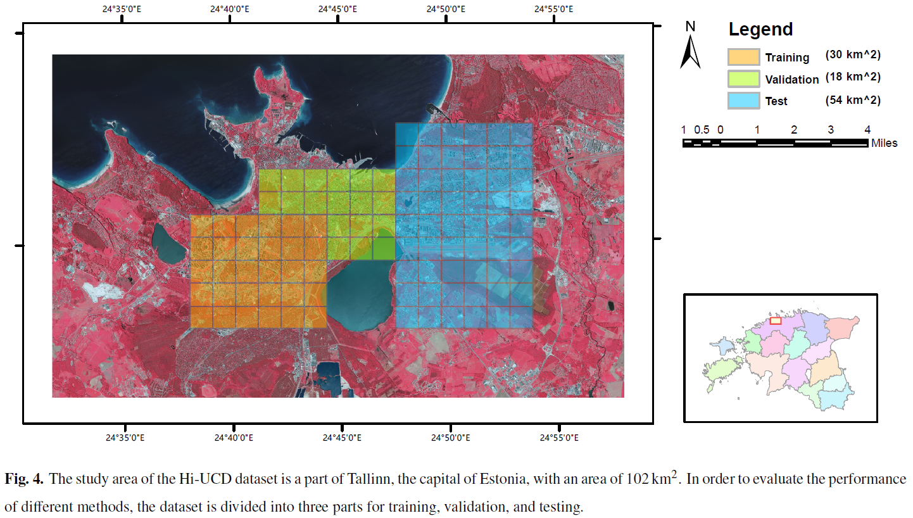

# Hi-UCD Series Dataset

Hi-UCD (ultra-High Urban Change Detection) series datasets are designed for deep learning based urban semantic change detection.


## News
- 2023/9/10 Hi-UCD mini is released.
- 2024/7/18 Hi-UCD is released.

## Hi-UCD mini

[`Paper`](https://arxiv.org/abs/2011.03247) [`Data`](https://drive.google.com/drive/folders/1fzAn4Bez_S6KX83iYABjAlASCzzhRJPQ?usp=sharing)


The Hi-UCD mini dataset can be downloaded through the Google Drive link.
Please submit a download request through the link and I will process your request as soon as possible.


## Hi-UCD 

[`paper`](https://www.sciencedirect.com/science/article/abs/pii/S0924271622002210) [`Data`](https://docs.google.com/forms/d/e/1FAIpQLSfEJ8z4ubdRbjDjTdr4kFeaLnhtiDNf_lxF-Y6Fee2C-RV9ag/viewform?usp=sf_link)




The characteristics of Hi-UCD:

1. 40800 pairs ultra-high resolution images (0.1 m) for Tallinn, Estonia.
2. Focus on refined urban semantic change detection.
3. Include 2 years of images, 9 land cover classes and 48 semantic change classes. 
4. Tasks that can be performed on this dataset: semantic segmentation, binary change detection, semantic change detection, etc.

The Hi-UCD dataset can be downloaded through the [Baidu Drive link](https://pan.baidu.com/s/1Q4wv4jfY4xDHorGSzF0mmw?pwd=0zgp) and [OneDrive link](https://docs.google.com/forms/d/e/1FAIpQLSfEJ8z4ubdRbjDjTdr4kFeaLnhtiDNf_lxF-Y6Fee2C-RV9ag/viewform?usp=sf_link). 

If you want to get the test scores, please join our hosted benchmark platform: [semantic change detection](https://www.codabench.org/competitions/3485/).

## Semantic label and palette
|Number|Class|Palette|
|---|---|---|
|0| unlabeled|(255,255,255)|
|1|Water|(0, 153,255 )|
|2|grass|(202, 255, 122)|
|3|building|(230, 0, 0)|
|4|green house| (230, 0, 255)|
|5|road|(255, 230, 0)|
|6|bridge|(255 ,181 ,197)|
|7|others|(0, 255, 230)|
|8|bare land|(175, 122, 255)|
|9|woodland|(26,255,0)|

## Change label and palette

|Number|Class|Palette|
|---|---|---|
|0| unlabeled|(255,255,255)|
|1|unchanged|(0,0,0)|
|2|changed|(220,	0,	0)|


## Citation
If you use Hi-UCD series dataset in your research, please cite our papers as follows:
```
@article{tian2020hi,
  title={Hi-UCD: A large-scale dataset for urban semantic change detection in remote sensing imagery},
  author={Tian, Shiqi and Ma, Ailong and Zheng, Zhuo and Zhong, Yanfei},
  journal={arXiv preprint arXiv:2011.03247},
  year={2020}
}

@article{tian2022large,
  title={Large-scale deep learning based binary and semantic change detection in ultra high resolution remote sensing imagery: From benchmark datasets to urban application},
  author={Tian, Shiqi and Zhong, Yanfei and Zheng, Zhuo and Ma, Ailong and Tan, Xicheng and Zhang, Liangpei},
  journal={ISPRS Journal of Photogrammetry and Remote Sensing},
  volume={193},
  pages={164--186},
  year={2022},
  publisher={Elsevier}
}

@article{tian2023temporal,
  title={Temporal-agnostic change region proposal for semantic change detection},
  author={Tian, Shiqi and Tan, Xicheng and Ma, Ailong and Zheng, Zhuo and Zhang, Liangpei and Zhong, Yanfei},
  journal={ISPRS Journal of Photogrammetry and Remote Sensing},
  volume={204},
  pages={306--320},
  year={2023},
  publisher={Elsevier}
}

@article{zheng2022changemask,
  title={ChangeMask: Deep multi-task encoder-transformer-decoder architecture for semantic change detection},
  author={Zheng, Zhuo and Zhong, Yanfei and Tian, Shiqi and Ma, Ailong and Zhang, Liangpei},
  journal={ISPRS Journal of Photogrammetry and Remote Sensing},
  volume={183},
  pages={228--239},
  year={2022},
  publisher={Elsevier}
}
```


## License
The use of Hi-UCD series dataset must follow the [licence of open data by Estonian Land Board](https://geoportaal.maaamet.ee/docs/Avaandmed/Licence-of-open-data-of-Estonian-Land-Board.pdf).
Hi-UCD series dataset can be used for academic purpose only, **but any commercial use is prohibited**.
